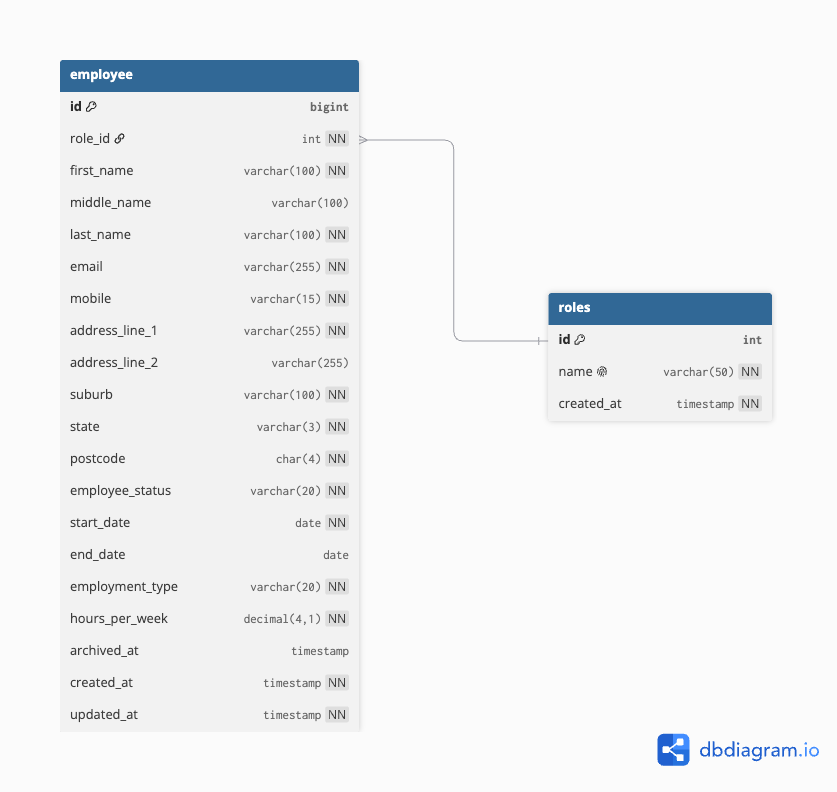

# Employees Creator

<!-- Test badges (nology requirement). Uncomment and point at the real workflows once CI lands.
[](https://github.com/morganthen/employees-creator/actions/workflows/maven.yml)
[](https://github.com/morganthen/employees-creator/actions/workflows/node.js.yml)
-->

## Demo & Snippets

- **Hosted Link:** TBD (deployment target: AWS, RDS + Elastic Beanstalk/EC2)
- **App Preview:** TBD once the client app exists. Add screenshots to `./docs/images/`.

---

## Requirements / Purpose

### MVP & Purpose

Employees Creator is a full-stack employee records system. Users can create and manage employee records covering personal details, role, employment status, contract dates and working hours. The project is built as a portfolio-grade full-stack app that goes deep on the patterns interviews probe: layered backend architecture, relational schema design, validation and testing.

### Tech Stack

- **Backend:** Java 17, Spring Boot 4.1.1, Spring Data JPA, MySQL, Bean Validation, Maven.
- **Frontend (planned):** React, TypeScript, Vite, React Query, React Router, Tailwind CSS.
- **Testing & Tools:** JUnit, Mockito, REST Assured, Vitest, React Testing Library, Git, GitHub Actions, OpenAPI/Swagger.

**Why this stack?**

- **Java & Spring Boot:** the mainstream stack for Australian backend roles, and a framework that makes layered architecture (controller, service, repository) explicit.
- **MySQL & Spring Data JPA:** real relational modelling with foreign keys, constraints and referential integrity.
- **Bean Validation:** structural validation at the DTO boundary, kept in one place.
- **React & TypeScript:** a type-safe client that consumes the REST API (planned).

### Database Schema

<p align="center">

</p>

Two tables: `employee` and `role`, joined N:1 (`employee.role_id` to `role.id`).

---

## Build Steps

### Prerequisites

- Java JDK 17+ (developed on JDK 25)
- Maven, or the bundled `./mvnw` wrapper
- MySQL 8+ running locally

### Backend Setup

1. Create the database:

   ```bash
   mysql -u root -p -e "CREATE DATABASE employees_creator;"
   ```

2. Configure `src/main/resources/application.properties` (see Environment Variables below).

3. Build and run the Spring Boot application:

   ```bash
   ./mvnw spring-boot:run
   ```

4. Run the tests:

   ```bash
   ./mvnw test
   ```

5. Once running, the API is available at `http://localhost:8080`, and Swagger UI at `http://localhost:8080/swagger-ui/index.html` (once springdoc-openapi is added).

---

### Environment Variables

| Variable      | Description                  | Example / Default       |
| :------------ | :--------------------------- | :---------------------- |
| `DB_HOST`     | Database host address        | `localhost`             |
| `DB_PORT`     | Database port number         | `3306` (MySQL)          |
| `DB_NAME`     | Name of the database         | `employees_creator`     |
| `DB_USER`     | Database connection username | `root`                  |
| `DB_PASSWORD` | Database connection password | (empty for local MySQL) |

### Example `.env` file

```env
DB_HOST=localhost
DB_PORT=3306
DB_NAME=employees_creator
DB_USER=root
DB_PASSWORD=
```

Mapped in `application.properties`:

```properties
spring.config.import=optional:file:.env[.properties]
spring.datasource.url=jdbc:mysql://${DB_HOST}:${DB_PORT}/${DB_NAME}?createDatabaseIfNotExist=true
spring.datasource.username=${DB_USER}
spring.datasource.password=${DB_PASSWORD}
spring.jpa.hibernate.ddl-auto=update
```

---

## Design Goals / Approach

- **Diagram-first schema design.** Entities, relations and constraints are scoped on a database diagram before any Java is written.
- **Layered backend architecture.** Controllers to services to repositories, with request and response DTOs at the boundary. Business rules live in the service layer.
- **DTO boundary.** Entities are never serialized directly. Requests carry Bean Validation; responses are shaped for the client.
- **Archive over delete.** Records carry an `archived_at` timestamp so employment history is preserved. Email uniqueness applies to active rows only.
- **Roles as a lookup table.** Roles change without a code deploy and feed the form dropdown through `GET /api/roles`.
- **AU-only address handling.** Australian mobile format, AU states and 4-digit postcodes. No country column.
- **Hand-rolled over generated.** No Lombok. Entities use explicit accessors and mappers; API-boundary DTOs are Java 17 records, so every pattern can still be explained.

---

## Features

- [x] Spring Boot scaffold boots (Maven, Spring Boot 4.1.1, Java 17 target)
- [x] `role` lookup entity, repository, service, DTO, controller (`GET /api/roles`) and seeder
- [x] OpenAPI/Swagger via springdoc
- [x] `employee` entity, `EmployeeStatus`/`EmploymentType` enums and repository
- [x] `CreateEmployeeRequest` record DTO with Bean Validation constraints
- [ ] Employee create, read, update and archive endpoints
- [ ] Bean Validation wired through the create endpoint (`@Valid`)
- [ ] Role dropdown fed from the API (client)
- [ ] React + TypeScript client

---

## Known Issues

- No CI workflow yet, so the test badges above are placeholders until GitHub Actions is added.
- Local dev connects as MySQL `root` with an empty password, read from `.env`. Set a real password and keep it out of version control before any non-local use.
- Authentication/authorization is deferred, so `GET /api/roles` and the Swagger docs are currently public.
- No global exception handling or standard API error shape yet.

---

## Future Goals

- Debounced Australian address autocomplete (Mapbox or Geoapify free tier)
- Pagination, search, filter and sort on the employee list
- Roles N:M upgrade (`employee_role` join table) if an employee needs multiple roles
- CSV export and audit log
- Sentry + PostHog, Playwright end-to-end tests
- AWS deployment (RDS + Elastic Beanstalk/EC2)

---

## Change Logs

**02/10/2026 - Project Scaffold & Schema Design**

- Generated the Spring Boot project (Maven, Spring Boot 4.1.1, Java 17 target) with dependencies: Spring Data JPA, Spring Web MVC, Validation, MySQL Driver, DevTools.
- Designed the initial database schema (`employee` + `role`, N:1) and recorded the deferred decisions with explicit triggers.
- Added the database ERD to `docs/images/` and embedded it in the README.
- Added the MIT `LICENSE` file.
- Added this README following the nology README standard.

**03/10/2026 - MySQL Wiring & Role Entity**

- Wired the app to MySQL: `application.properties` reads `${DB_*}` placeholders from a gitignored `.env` via `spring.config.import=optional:file:.env[.properties]`.
- Created the `role` entity (`Long` id mapped to MySQL `BIGINT` identity, unique `name`, `createdAt` audit field).
- Dropped the `description` field from `role` (YAGNI) and updated the ERD.

**04/10/2026 - Role Vertical Slice & Swagger**

- Completed the Role slice end to end: `RoleRepository` (`JpaRepository<Role, Integer>`, `findByName`, `existsByName`), `RoleService` (`findAll`, `getDefaultRole`), `RoleResponse` record, `RoleController` (`GET /api/roles`) and a `RoleSeeder` that seeds Executive, Manager and Staff.
- Changed the Role id to `int` (repository id type `Integer`); `employee.id` stays `Long`.
- Added springdoc-openapi `3.0.3` for Swagger, live at `/swagger-ui/index.html`.

**05/10/2026 - Employee Entity, Enums & Create DTO**

- Added the `Employee` entity: `Long` id (`BIGINT`), `@ManyToOne` `role` (`role_id`, NOT NULL), `LocalDate` contract dates, `BigDecimal` `hours_per_week` (`DECIMAL(4,1)`), `@Enumerated(EnumType.STRING)` status/type, and an `archived_at` archive flag.
- Renamed `EmployeeEntity` to `Employee` for symmetry with `Role`; dropped `@Email`/`@DateTimeFormat` off the entity (validation belongs on the DTO) and fixed the `employment_type` column typo.
- Added `EmployeeStatus` (`PERMANENT`, `CONTRACT`) and `EmploymentType` (`FULL_TIME`, `PART_TIME`) enums.
- Added `EmployeeRepository` (`JpaRepository<Employee, Long>`) with `existsByEmailAndArchivedAtIsNull`, `findByArchivedAtIsNull` and `findByIdAndArchivedAtIsNull`.
- Added `CreateEmployeeRequest` as a record DTO carrying Bean Validation (`@NotBlank`, `@NotNull`, `@Email`, `@Pattern`, `@Size`, `@DecimalMin`/`@DecimalMax`).
- Stubbed `EmployeeController` at `/api/employees`.

**07/10/2026 - Employee Service (Create + Read Rules)**

- Added `EmployeeResponse` as the full employee representation (all fields plus `roleId`/`roleName`), replacing the placeholder record.
- Added `EmployeeService`:
  - `findAll()` returns active-only employees (`findByArchivedAtIsNull`), mapped to `EmployeeResponse`, under `@Transactional(readOnly = true)`.
  - `create(CreateEmployeeRequest)` resolves the `roleId`, rejects a duplicate active email (409), enforces `endDate >= startDate`, normalises the mobile to `+614...`, maps the DTO to an `Employee` entity, saves, and returns the mapped saved entity.
- Kept the entity inside the service boundary; the repository deals only in entities, the controller only in DTOs.

**08/10/2026 - Layering Consistency, Employee Endpoints & Schema Reset**

- Refactored the Role slice to match the Employee slice and the Flow Map: `RoleService.findAll` and `getDefaultRole` now return `RoleResponse` (mapping inside the service), and `RoleController` just delegates.
- Both controllers are now pure traffic controllers; both services return DTOs. The entity never leaves the service.
- Wired `EmployeeController` (`GET /api/employees`, `POST /api/employees`) and tested both in Swagger.
- Reset the local `employees` table: `ddl-auto=update` had accumulated stale columns from earlier field renames (see struggles).

---

## What did you struggle with?

**02/10/2026**

- **Scope creep vs YAGNI on the schema:** judging which future needs to design for now (a separate addresses table, multi-role employees, public IDs) against keeping the MVP small. Resolved by limiting the MVP to two tables and writing down an explicit trigger for each deferred decision.

**03/10/2026**

- **Database wiring after a month off:** forgot the connection setup entirely and used the previous Spring Boot project as a starting point.
- **JPA constructors:** added a `Role(String name)` constructor and forgot that it removes the implicit no-arg constructor Hibernate requires.
- **Small details that slipped:** camelCase field naming, that `LocalDateTime` is available for audit timestamps, and matching the entity's `Long` id to the DB's `BIGINT`.

**04/10/2026**
- **Seeing the whole picture.** Spring Boot's conventions make each piece look small, but it was hard to see how controller, service, repository, DTO and entity join up end to end, so it felt like something to memorise. A one-page flow map fixed that.
- **Repository id-type mismatch.** Switched `Role.id` to `int` but left `JpaRepository<Role, Long>`; the repository's id type must match the entity's identifier type.
- **A silent seeder.** `@Profile("dev")` meant the seeder never ran because no profile was active. Removed the restriction for now; the `count() == 0` guard keeps it safe.
- **Swagger not loading.** Needed the right springdoc line (3.x for Spring Boot 4), a Maven reload, and a restart, since a dependency change alters the classpath.

**05/10/2026**

- **Records as request DTOs.** Had only used a record for the response side (`RoleResponse`) and had never seen one as an inbound DTO. Learned that Jackson deserialises records through the canonical constructor (no getters/setters required), and that Bean Validation constraints written on record components apply to the field, the constructor parameter and the accessor. Accessors are component-named (`firstName()`), not `getFirstName()`.
- **Why DTOs need accessors at all.** The sticking point was that the entity has no accessors yet works. Entity fields are populated by Hibernate via reflection; DTO fields are populated by Jackson from JSON, which discovers Java properties through getters/setters (or a matching constructor). A record supplies that constructor for free.
- **`@NotBlank` only validates `CharSequence`.** Applied it to `Integer roleId` and `LocalDate` fields, which fails at validation time with `UnexpectedTypeException`; required non-string fields need `@NotNull`.
- **Optional vs required fields.** Marked `middleName` and `addressLine2` as `@NotBlank` when the ERD makes them nullable — validation constraints must mirror the schema's nullability.
- **Record component lists can be long.** Didn't realise a record's parameter list in the round brackets can hold as many components as needed — all 16 `CreateEmployeeRequest` fields live there, so the whole DTO shape sits in one place instead of being spread across fields, getters and setters.

**07/10/2026**

- **Where the response DTO actually belongs.** Thought the DTO travelled DB → repo → service. It doesn't: the repository deals in **entities**, and the response DTO is produced in the **service** and handed to the controller. Entities never cross the API boundary.
- **`save()` returns the entity.** Didn't know `JpaRepository.save(T)` returns the managed entity with its generated `id` and `@CreationTimestamp`/`@UpdateTimestamp` values populated — so map the **returned** instance, not the one passed in.
- **Two `@Transactional` annotations.** `readOnly = true` is undefined on `jakarta.transaction.Transactional`; the Spring one (`org.springframework.transaction.annotation.Transactional`) has it. Swapped the import.
- **Format vs business rules.** Single-field format checks live on the DTO; rules needing another field or the database (active-email uniqueness, `endDate >= startDate`) live in the service.
- **Lazy loading in the mapping.** `EmployeeResponse.of` reads `employee.getRole().getName()`, and `role` is `FetchType.LAZY`, so the mapping needs an open transaction or it throws `LazyInitializationException`. Also flagged the N+1 risk on the list (fix later with `@EntityGraph` / join fetch).

**08/10/2026**

- **Which layer maps entity → DTO.** Role mapped entity→DTO in the controller while Employee mapped in the service, so the codebase carried two competing patterns. Picked the service-returns-DTO rule (per the Flow Map) and pushed Role to match rather than regressing Employee.
- **A return-type change ripples to call sites.** Changing `RoleService.findAll` to return `RoleResponse` broke `RoleController`, which still expected `List<Role>`; the compiler caught it. The service and its callers must move together.
- **`ddl-auto=update` rots the schema (a real 500).** After renaming `emploment_type` → `employment_type`, the insert failed with *"Field 'emploment_type' doesn't have a default value"*. `update` is **additive only** — it added the new column but never dropped the old `NOT NULL` one, so the table carried both plus other leftovers from earlier drafts. Fixed by dropping and recreating the local table. Lesson: `ddl-auto=update` is fine for a spike but is not a migration tool; real projects use Flyway/Liquibase with `ddl-auto=validate`.

---

## Licensing Details

This project is licensed under the [MIT License](LICENSE).

---

## Further details, related projects, reimplementations

- **Backend API:** Spring Boot REST API serving employee and role endpoints (in progress).
- **Frontend Application:** React + TypeScript single-page app consuming the REST endpoints (planned).
- **Related project:** extends the patterns from an earlier Spring Boot build, the Java + React To Do API (https://github.com/morganthen/rmndr): layered controllers, services, repositories, DTOs, soft delete, OpenAPI.
